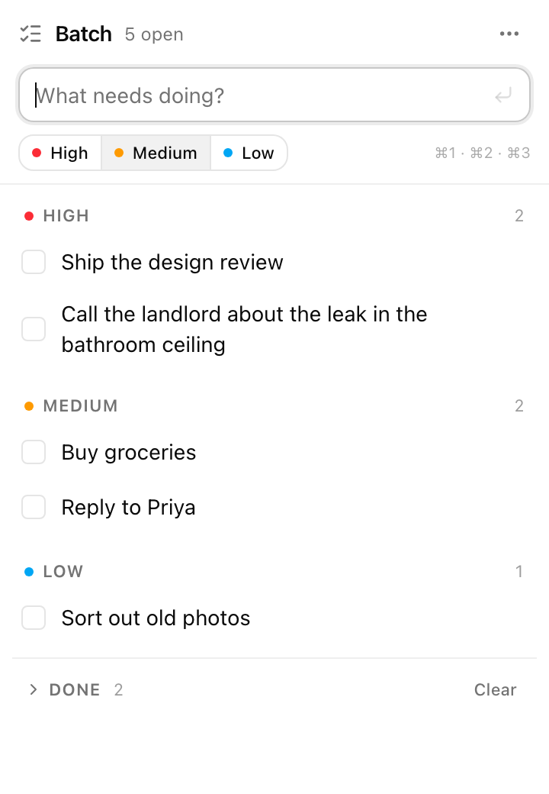
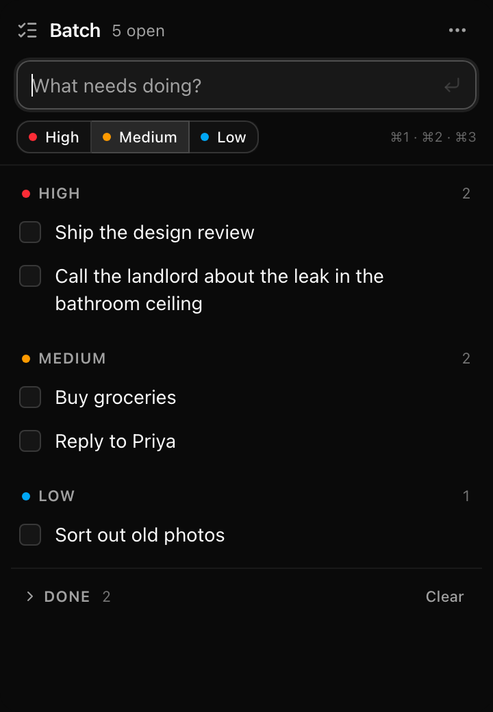

# Batch

A tiny macOS menu-bar checklist. Click the ✓ icon in the menu bar (or press
**⌥⇧Space**) and a small popover drops down. Type — or dictate with Wispr Flow —
and press ↵. Each line becomes an item. Items have a priority (High / Medium /
Low) and the list is shown in priority sections with a collapsible **Done**
section at the bottom.

Built with **Tauri v2** (Rust shell) + **React** + **Tailwind v4** + **shadcn/ui**.

<p>
  
  
</p>

## Run it

```sh
bun install
bun run app:dev        # = tauri dev; opens the popover automatically in dev builds
```

Build a signed-for-local-use `.app` + `.dmg`:

```sh
bun run app:build                    # → src-tauri/target/release/bundle/macos/Batch.app
bun run tauri build --bundles dmg    # also make a .dmg (uses Finder scripting)
```

Then drag `Batch.app` into `/Applications` and open it — the ✓ appears in the
menu bar (there's no Dock icon by design).

> `app:dev` / `app:build` prepend `~/.cargo/bin` to `PATH`, so they work even
> if you haven't added Rust to your shell profile. Plain `bun run tauri …` does
> the same. If you'd rather have `cargo` everywhere: `source ~/.cargo/env`.

Web-only preview (no native shell, uses `localStorage`):

```sh
bun run dev            # http://localhost:1420/
#   ?seed=1            sample data (not persisted)
#   ?theme=dark|light  force a theme
```

## Using it

| Action | How |
| --- | --- |
| Show / hide | click the menu-bar icon · **⌥⇧Space** · `Esc` (when input is empty) · `⌘W` |
| Add an item | type, press ↵ (multi-line paste adds one item per line) |
| Priority for the next item | click High / Medium / Low, or `⌘1` / `⌘2` / `⌘3` |
| Change an item's priority | hover → flag icon (cycles High → Medium → Low) |
| Edit an item | double-click its text · ↵ saves · `Esc` cancels |
| Complete / delete | checkbox · hover → × |
| Clear completed | Done section → **Clear**, or the ⋯ menu, or `⌘⇧⌫` |
| Keep the window open | 📌 pin (otherwise it hides when it loses focus) |
| Move it | drag the header |
| Quit | ⋯ menu → Quit, right-click menu-bar icon → Quit, or `⌘Q` |

Data lives in `~/Library/Application Support/dev.tanuja.batch/todos.json`.

## Layout

```
src/
  lib/todos.ts          pure domain logic (tested: bun run test)
  lib/priority-ui.ts    colours/labels per priority
  lib/native.ts         invoke() bridge → Rust; no-ops in the browser
  store/persistence.ts  tauri-plugin-store (app) / localStorage (browser)
  store/useTodos.ts     React hook: reducer + debounced save
  components/           Header, CaptureBar, PrioritySection, DoneSection, TodoItem
  components/ui/        shadcn components
  App.tsx               layout + keyboard handling
src-tauri/
  src/lib.rs            tray, global hotkey, positioning, hide-on-blur, vibrancy
  tauri.conf.json       window: 360×520, borderless, transparent, always-on-top
scripts/render-icons.swift  regenerates app + menu-bar icons (bun run icons)
docs/superpowers/specs/     design spec
```

## Changing the hotkey

`toggle_shortcut()` in [src-tauri/src/lib.rs](src-tauri/src/lib.rs) — one line.
Also update the tray menu label next to it and this README.

## Not yet (deliberately)

Widget (WidgetKit — needs a Swift extension), launch at login, sync, due
dates, tags, natural-language priority ("… high priority" → High), notifications.
