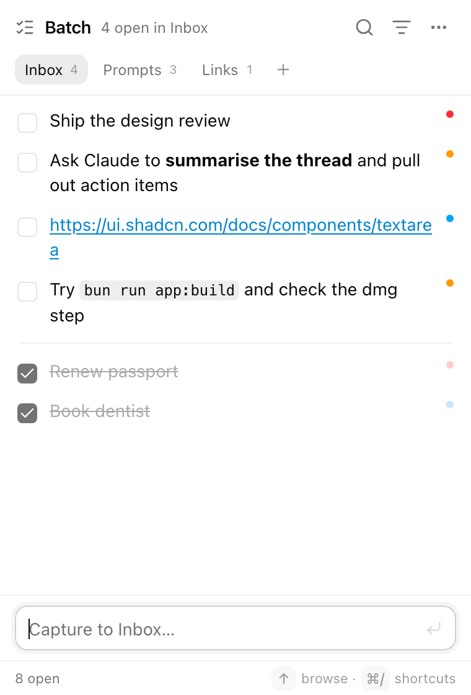
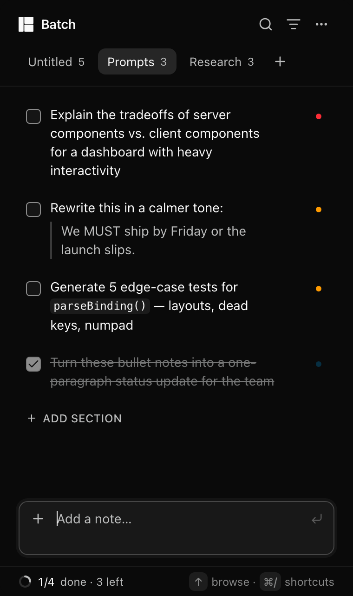
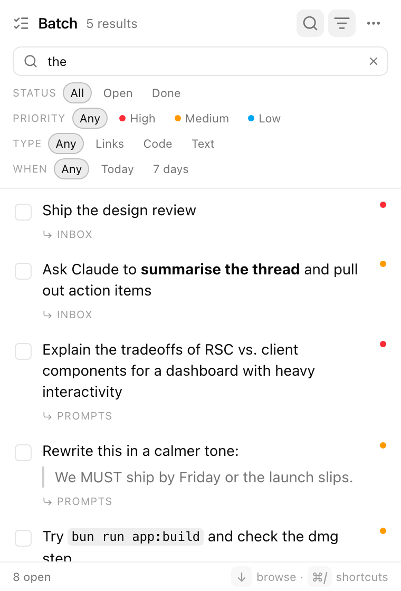

# Batch

A tiny macOS menu-bar app for the bits you want to keep while working with
ChatGPT, Claude, Cursor & co: prompts to try next, answers worth saving, links,
ideas. **Tap Shift twice** (or press ⌥⇧Space) anywhere → Batch drops down with
the input focused → type or paste → ↩. Later, arrow to a note, **⌘C** it back
into whatever you're using, and check it off.

Batch combines the useful parts of a to-do list, a clipboard, and a scratchpad.
Notes are Markdown, live in **folders**, can be **merged**, **copied as a list**,
**searched** and **filtered**. Everything is **keyboard-first** and every shortcut
is **customisable**. Your notes are one **local JSON file**. No account, no sync,
no tracking, nothing phones home.

Built with **Tauri v2** (Rust shell) + **React** + **Tailwind v4** + **shadcn/ui**.

<p>
  
  
  
</p>

## Run it

```sh
bun install
bun run app:dev        # = tauri dev; opens the popover automatically in dev builds
```

Build the app:

```sh
bun run app:build                    # → src-tauri/target/release/bundle/macos/Batch.app
bun run tauri build --bundles dmg    # also make a .dmg (uses Finder scripting)
```

Drag `Batch.app` into `/Applications` and open it — the ✓ appears in the menu
bar (there's no Dock icon by design).

> `app:dev` / `app:build` prepend `~/.cargo/bin` to `PATH`, so they work even
> if Rust isn't in your shell profile. If you'd rather have `cargo` everywhere:
> `source ~/.cargo/env`.

Web-only preview (no native shell, uses `localStorage`):

```sh
bun run dev            # http://localhost:1420/
#   ?seed=1                       sample sections + notes (not persisted)
#   &theme=dark|light             force a theme
#   &section=prompts              open a section
#   &search=foo  &filters=1       open search / filter row
#   &view=settings|help           open a panel
```

### Double-Shift needs Input Monitoring

The double-tap-Shift listener is a listen-only macOS event tap, which needs
**System Settings → Privacy & Security → Input Monitoring → Batch** (macOS adds
Batch to that list the first time it starts). Batch shows a one-line banner with
a **Grant** button until it's allowed, then a **Relaunch** button — macOS only
applies a fresh Input Monitoring grant to a new process. The ⌥⇧Space hotkey and
the menu-bar icon work regardless. Because this personal build is ad-hoc
signed, macOS may treat a rebuild as a new app — re-tick Batch in that list
after rebuilding if the banner comes back.

## Using it

| Action | How |
| --- | --- |
| Show / hide | ⇧⇧ (double-tap Shift) · ⌥⇧Space · click the menu-bar icon · `Esc` when the input is empty · ⌘W |
| Add a note | capture box at the bottom: type / paste (Markdown, multi-line), ↩ · ⇧↩ for a newline |
| Attach images | ⊕ → *Attach images…*, paste an image (⌘V), or drop files anywhere on the window · up to **10** per note · a note can be images only · thumbnails show above the text (click to open) · ⊕ also has *New folder* |
| Copy with images | ⌘C / ⋯ → Copy puts the **text and the image files** on the clipboard together — paste once into ChatGPT, Claude, Cursor… (they read the files; text fields get the text) · drag a thumbnail out to drop the note's images into another app |
| Folders | tabs at the top (the first is "Untitled" until you rename it) · ⌘1…⌘9 switch · ⇧⌘N new · click the active folder's name to rename (or ⋯ → Rename folder, or right-click) · right-click also has Copy as list / Clear done / Delete |
| Browse | ↑ from the capture box enters the list (↓ past the last note returns) · ↑↓ move · ⇧↑↓ extend · ⌘A select all · click / ⌘-click / ⇧-click |
| Copy | ⌘C — one note copies its text; several copy as a Markdown list · ⇧⌘C copies the whole section as a list |
| Merge notes | select 2+ → ⌘M (texts joined, earliest note kept, ⌘Z to undo) |
| Done | Space (or the checkbox); done notes sink below a hairline · ⇧⌘⌫ clears done in the section |
| Edit | ↩ or double-click · ↩ saves · `Esc` cancels |
| Priority | 1 / 2 / 3 on the selected notes · hover → ⋯ → Priority · shown as a coloured dot |
| Move to another section | ⇧⌘] / ⇧⌘[ · or hover → ⋯ → Move to |
| Search | ⌘F — searches all sections; results show their section |
| Filters | ⇧⌘F — Status (All / Open / Done) · Priority · Type (Links / Code / Text) · When (Today / 7 days) |
| Undo / redo | ⌘Z / ⇧⌘Z (every note change, 50 steps) |
| Delete | ⌫ on selected notes · hover → ⋯ → Delete |
| Pin (stay open when unfocused) | 📌 or ⌘P |
| Appearance | ⋯ menu → Appearance, or Settings: System / Light / Dark (the vibrancy backdrop follows) |
| Settings | ⌘, — appearance, launch at login, double-Shift, hotkey, custom shortcuts, data location |
| Shortcut cheat-sheet | ⌘/ |
| Quit | ⋯ menu → Quit, right-click menu-bar icon → Quit, or ⌘Q |

Data lives in `~/Library/Application Support/dev.tanuja.batch/notes.json`
(settings in `settings.json`, images in `attachments/` with PNG thumbnails in
`attachments/thumbs/`, all next to it). ⋯ menu → **Reveal notes file in Finder**.
Unreferenced image files are cleaned up on launch. A v1 `todos.json` is imported
on first run.

## Layout

```
src/
  lib/notes.ts          sections + notes reducer, selectors, migration (tested)
  lib/filters.ts        status / priority / type / when filters (tested)
  lib/format.ts         copy-as-list, merge text (tested)
  lib/shortcuts.ts      binding parse/format/match, defaults, Tauri conversion (tested)
  lib/history.ts        undo/redo wrapper (tested)
  lib/native.ts         invoke() bridge → Rust; no-ops in the browser
  store/persistence.ts  tauri-plugin-store (app) / localStorage (browser), v1 import
  store/useNotes.ts     reducer + history + debounced save
  store/useSettings.ts  hotkey, double-shift, keymap
  hooks/useListNav.ts   cursor + multi-selection model
  components/           Header, SectionTabs, CaptureBox, NoteList/NoteRow, Markdown,
                        SearchAndFilters, Footer, SettingsPanel, ShortcutRecorder,
                        HelpSheet, AccessibilityBanner
  components/ui/        shadcn components
  App.tsx               wiring + all keyboard handling
src-tauri/
  src/lib.rs            tray, hotkey (re-registrable), positioning, hide-on-blur,
                        vibrancy, permission prompt, open/reveal helpers
  src/double_shift.rs   CGEventTap double-tap-Shift listener (own thread)
  src/attachments.rs    image files + thumbnails, GC, NSPasteboard text+files copy
scripts/render-icons.swift  regenerates app + menu-bar icons (bun run icons)
docs/superpowers/specs/     design specs (v1, v2)
```

`bun run test` · `bun run typecheck` · debug builds log to `$TMPDIR/batch-dev.log`.

## Not yet (deliberately)

Widget (WidgetKit — needs a Swift extension), sync, updater ("free updates" here
= rebuild from source), due dates, tags, drag-reorder, capture the current
selection on double-Shift.
