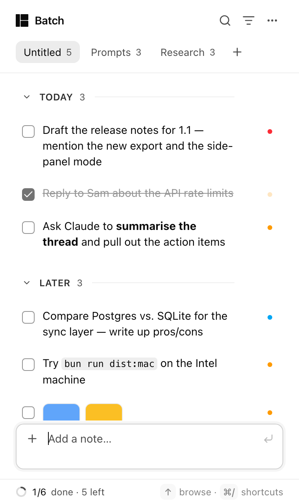

# Batch

<p>
  <a href="https://github.com/tanujapaunikar487/batch/releases/latest/download/Batch-1.1.0-universal.dmg"><b>⬇ Download Batch for macOS</b></a> — universal (Apple Silicon & Intel), macOS 12+, signed & notarized ·
  <a href="https://github.com/tanujapaunikar487/batch/releases">all releases</a>
</p>

> Free and open source (MIT). Your notes are stored locally, in one file on your Mac. No account, no sync, no tracking.

**Your scratchpad for AI work.** · [Try it in your browser →](https://tanujapaunikar487.github.io/batch/)

Batch is a small macOS menu-bar notepad. It's for the things you'd otherwise
lose while you're busy in ChatGPT, Claude, Cursor or a terminal: a prompt you
want to try next, an answer worth keeping, a link, a half-formed idea.

**Tap Shift twice** (or press ⌥⇧Space) from any app. Batch drops down from the
menu bar with the cursor already in the input box. Type or paste, press ↩, and
carry on. When you need something back, arrow to it, press **⌘C**, paste it
wherever you're working, and mark it done.

Notes are Markdown and live in **folders**. You can **search** across all
folders, **filter** them, **merge** several notes into one, **copy a selection
as a numbered list**, and **attach images**. Everything works from the
keyboard, and every shortcut can be changed.

Built with **Tauri v2** (Rust) + **React** + **Tailwind CSS**.

Inspired by [Copper](https://shadcn.com/copper) by [shadcn](https://x.com/shadcn) —
go check it out. Batch is my own take, built from scratch for my own use and
open-sourced.

<p>
  
  
  
</p>

## Install (download)

1. **[Download the DMG](https://github.com/tanujapaunikar487/batch/releases/latest/download/Batch-1.1.0-universal.dmg)** (or pick any version on the [Releases](https://github.com/tanujapaunikar487/batch/releases) page).
2. Open it and drag **Batch** onto **Applications**.
3. Launch Batch (Spotlight → "Batch"). The Batch mark appears in the **menu bar** — there's no Dock icon by design.

(To build it yourself: `bun run dist:mac` → `dist-mac/`.)

Releases are signed with a Developer ID and notarized by Apple, so they open
without any Gatekeeper warning. (If you build the DMG yourself without a
Developer ID, right-click Batch.app → Open once.)

Then, when Batch asks: allow **Input Monitoring** (for the double-Shift trigger)
and, if you turn on *Capture selected text*, **Accessibility** — both under
*System Settings → Privacy & Security*. Relaunch after granting.

Maintainers: `bun run dist:mac` builds, signs, notarizes and staples automatically
when a "Developer ID Application" certificate is in the Keychain and a
`batch-notary` notarytool profile exists (`xcrun notarytool store-credentials …`).
Pushing a `v*` tag runs the GitHub workflow, which attaches an (unsigned unless the
`APPLE_*` secrets are set) DMG to the release; upload the notarized one with
`gh release upload vX.Y.Z dist-mac/*.dmg --clobber`.

## Use it with your AI agents

Batch ships a tiny local server (`batch-mcp`) that speaks the **Model Context
Protocol**, so Claude Code, Cursor or Codex can read and tick off your notes
directly. It edits the same `notes.json` the app uses and the app refreshes
live — nothing leaves your Mac.

Add it to Claude Code (Settings → **Agents (MCP)** in Batch shows the exact line
with a Copy button):

```sh
claude mcp add batch -- /Applications/Batch.app/Contents/MacOS/batch-mcp
```

Then, from the agent: *"list my Batch prompts and work through them, marking
each done."* Tools: `list_folders`, `list_notes`, `add_note`, `mark_done`,
`mark_open`, `reply` (writes an **outcome** shown under the note), `get_note`.

Two more things that make hand-off clean:

- **Copy for agent** (right-click a note or ⌥⌘C) copies a structured block —
  folder title, optional per-folder **instructions**, numbered items tagged by
  priority, plus where each came from and any image filenames. One paste and the
  agent has the context, not just the text.
- **⇧⇧ remembers the source.** Select text in ChatGPT/Claude/Cursor, tap Shift
  twice, and the note keeps a *"from Arc · <window title>"* chip.
- **⌥⇧S** grabs a screen region into the capture box — visual feedback for any
  Mac app, not just web pages.

## Best practices

- Queue the next prompts in Batch while the current one is still running, then
  send them in a batch with **Copy for agent** into a fresh chat.
- One **folder per project**; add **Agent instructions** (⋯ menu) so every
  hand-off carries the same context.
- Let the agent tick items off and **reply** with the outcome — Batch updates in
  place, so your list is the shared to-do between you and your AI.

## Run it

```sh
bun install
bun run app:dev        # = tauri dev; opens the popover automatically in dev builds
```

Build the app:

```sh
bun run app:build                    # → src-tauri/target/release/bundle/macos/Batch.app
bun run tauri build --bundles dmg    # also make a .dmg (uses Finder scripting)
```

Drag `Batch.app` into `/Applications` and open it — the ✓ appears in the menu
bar (there's no Dock icon by design).

> `app:dev` / `app:build` prepend `~/.cargo/bin` to `PATH`, so they work even
> if Rust isn't in your shell profile. If you'd rather have `cargo` everywhere:
> `source ~/.cargo/env`.

**Keep permissions across rebuilds:** run `bun run sign:setup` once. It creates a
self-signed "Batch Dev" code-signing certificate in your login keychain; `app:build`
signs with it automatically, so macOS treats every build as the same app and the
Input Monitoring / Accessibility grants stick.

Web-only preview (no native shell, uses `localStorage`):

```sh
bun run dev            # http://localhost:1420/
#   ?seed=1                       sample sections + notes (not persisted)
#   &theme=dark|light             force a theme
#   &section=prompts              open a section
#   &search=foo  &filters=1       open search / filter row
#   &view=settings|help           open a panel
```

### Double-Shift needs Input Monitoring

The double-tap-Shift listener is a listen-only macOS event tap, which needs
**System Settings → Privacy & Security → Input Monitoring → Batch** (macOS adds
Batch to that list the first time it starts). Batch shows a one-line banner with
a **Grant** button until it's allowed, then a **Relaunch** button — macOS only
applies a fresh Input Monitoring grant to a new process. The ⌥⇧Space hotkey and
the menu-bar icon work regardless.

Downloaded releases are signed with a Developer ID, so the grant sticks. If you
build from source without a signing certificate, macOS may treat each rebuild as
a new app and the banner comes back — re-tick Batch in that list, or run
`bun run sign:setup` once (see *Keep permissions across rebuilds* above) so every
build shares one identity.

## Using it

| Action | How |
| --- | --- |
| Show / hide | ⇧⇧ (double-tap Shift) · ⌥⇧Space · click the menu-bar icon · `Esc` when the input is empty · ⌘W |
| Add a note | capture box at the bottom: type / paste (Markdown, multi-line), ↩ · ⇧↩ for a newline |
| Capture from another app | select text anywhere, tap ⇧⇧ — it lands in the capture box (needs Accessibility; Settings → *Capture selected text*) |
| Attach images | ⊕ → *Attach images…*, paste an image (⌘V), or **drag & drop** anywhere on the window — the images land in the capture box so you can add a prompt and press ↩ · accepts files from Finder and images dragged from browsers/apps · up to **10** per note · a note can be images only · thumbnails show above the text (click to open) · ⊕ also has *New folder* |
| Images on an existing note | drop images onto the note, or right-click → *Attach images…* · hover a thumbnail → × removes it (⌘Z undoes) |
| Copy with images | ⌘C / ⋯ → Copy puts the **text and the image files** on the clipboard together — paste once into ChatGPT, Claude, Cursor… (they read the files; text fields get the text) · drag a thumbnail out to drop the note's images into another app |
| Folders | tabs at the top (the first is "Untitled" until you rename it) · ⌘1…⌘9 switch · ⇧⌘N new · click the active folder's name to rename (or ⋯ → Rename folder, or right-click) · right-click also has Copy as list / Clear done / Delete |
| Browse | ↑ from the capture box enters the list (↓ past the last note returns) · ↑↓ move · ⇧↑↓ extend · ⌘A select all · click / ⌘-click / ⇧-click |
| Copy | ⌘C — one note copies its text; several copy their texts separated by blank lines |
| Copy as List | right-click → **Copy as List**, or ⇧⌘C — copies the selection (or the whole folder when nothing is selected) as a **numbered** list and marks those notes **done** (⌘Z undoes) |
| Right-click menu | Copy · Copy as List · Mark as Done · Edit · Merge Notes · Priority · Move to · Delete — acts on the whole selection when the note is part of it (the ⋯ button opens the same menu) |
| Merge notes | select 2+ → ⌘M or right-click → Merge Notes (texts joined, earliest note kept, ⌘Z to undo) |
| Done | Space (or the checkbox); done notes stay where they are, struck through · ⇧⌘⌫ / *Clear done* removes them |
| Edit | ↩ or double-click · ↩ saves · `Esc` cancels |
| Priority | 1 / 2 / 3 on the selected notes · hover → ⋯ → Priority · shown as a coloured dot |
| Move to another folder | ⇧⌘] / ⇧⌘[ · or ⋯ / right-click → Move to |
| Sections inside a folder | ⊕ → *New section*, or type `# Title` in the box — a heading row you can drag notes under (rename by clicking it; delete keeps its notes) · chevron collapses/expands it · moving a heading moves its whole section |
| Reorder | drag a note up or down within its folder (a line shows where it lands) · drag one of several selected notes to move them all · ⌥↑ / ⌥↓ · right-click → Move up / Move down · ⌘Z undoes |
| Search | ⌘F — searches all folders; results show their folder — click it (or ↩) to jump there with the note focused |
| Filters | ⇧⌘F — Status (All / Open / Done) · Priority · Type (Links / Code / Text) · When (Today / 7 days) |
| Undo / redo | ⌘Z / ⇧⌘Z (every note change, 50 steps) |
| Delete | ⌫ on selected notes · hover → ⋯ → Delete |
| Pin (stay open when unfocused) | 📌 or ⌘P |
| Expand / restore | ⌃⌘F, ⋯ menu, or double-click the header — docks Batch on the right at 40% of the screen's width and full height; again to restore |
| Resize | drag the grip in the bottom-right corner (or any edge); the size is remembered |
| Appearance | ⋯ menu → Appearance, or Settings: System / Light / Dark (the vibrancy backdrop follows) |
| Settings | ⌘, — appearance, launch at login, double-Shift, hotkey, custom shortcuts, data location |
| Shortcut cheat-sheet | ⌘/ |
| Quit | ⋯ menu → Quit, right-click menu-bar icon → Quit, or ⌘Q |

Data lives in `~/Library/Application Support/dev.tanuja.batch/notes.json`
(settings in `settings.json`, images in `attachments/` with PNG thumbnails in
`attachments/thumbs/`, all next to it). ⋯ menu → **Reveal notes file in Finder**.
Unreferenced image files are cleaned up on launch. A v1 `todos.json` is imported
on first run.

## Layout

```
src/
  lib/notes.ts          sections + notes reducer, selectors, migration (tested)
  lib/filters.ts        status / priority / type / when filters (tested)
  lib/format.ts         copy-as-list, merge text (tested)
  lib/shortcuts.ts      binding parse/format/match, defaults, Tauri conversion (tested)
  lib/history.ts        undo/redo wrapper (tested)
  lib/native.ts         invoke() bridge → Rust; no-ops in the browser
  store/persistence.ts  tauri-plugin-store (app) / localStorage (browser), v1 import
  store/useNotes.ts     reducer + history + debounced save
  store/useSettings.ts  hotkey, double-shift, keymap
  hooks/useListNav.ts   cursor + multi-selection model
  components/           Header, SectionTabs, CaptureBox, NoteList/NoteRow, Markdown,
                        SearchAndFilters, Footer, SettingsPanel, ShortcutRecorder,
                        HelpSheet, AccessibilityBanner
  components/ui/        UI primitives (Radix-based)
  App.tsx               wiring + all keyboard handling
src-tauri/
  src/lib.rs            tray, hotkey (re-registrable), positioning, hide-on-blur,
                        vibrancy, permission prompt, open/reveal helpers
  src/double_shift.rs   CGEventTap double-tap-Shift listener (own thread)
  src/attachments.rs    image files + thumbnails, GC, NSPasteboard text+files copy
scripts/render-icons.swift  regenerates app + menu-bar icons (bun run icons)
docs/superpowers/specs/     design specs (v1, v2)
```

`bun run test` · `bun run typecheck` · debug builds log to `$TMPDIR/batch-dev.log`.

## Data & safety

- Saves are atomic (temp file + rename) and a copy of the previous version is kept
  once a day in `backups/` (last 7). ⋯ → **Restore backup** lists them and replaces
  everything with the chosen day (⌘Z undoes). ⋯ → **Export** writes Markdown (optionally
  as a folder **with the image files**) or a JSON backup; **Import JSON…** merges one
  back in (folders matched by name, ⌘Z undoes).
- If `notes.json` ever can't be read, Batch shows a banner and **pauses saving**
  instead of overwriting; *Start fresh* moves the old file to `notes.corrupt-….json`.
- Only one instance runs; launching Batch again just brings it forward.
- Your unsent draft (text + images) survives hiding and quitting.

## Not yet (deliberately)

Widget (WidgetKit — needs a Swift extension), sync, updater ("free updates" here
= rebuild from source), due dates, tags.

## Contributing

Issues and PRs are welcome — see [CONTRIBUTING.md](CONTRIBUTING.md). MIT licensed.
